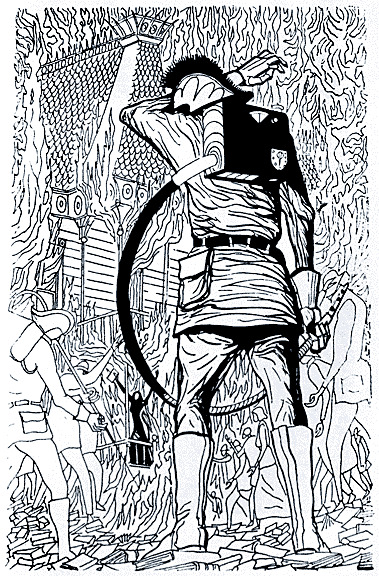

# FAHRENHEIT 451
## by RAY BRADBURY

> Is it because we're having so much fun at home we've forgotten the world? Is it because we're so rich and the rest of the world's so poor and we just don't care if the are? I'be heard rumors; the world is starving, but we're well fed. Is it true, the world works hard and we play? Is that why we're hated so much? I've heard the rumors about hate, too, once in along while, over the years. Do *you* know why? I don't, that's sure! Maybe the books can get us half out of the cave. They just *might* stop us from making the same damn insane mistakes! I don't hear those idiot bastards in your parlor talking about it.

> "You're a hopeless romantic," said Faber. "It would be funny if it were not serious. It's not books you need, It's some of the things that once were in books. The same things *could* be in the 'parlor families' today. The same infinite detail and awareness could be prohected through the readios and televisors, but are not. No, no, it's not books at all you're looking for! Take it where you can find it, in old phonograph records, old motion pictures, and in old friends; look for it in nature and look for it in yourself. Books were only one type of receptacle where we stored a lot of things we were afraid we might forget. There is nothing magical in them, at all. The magic is only in what books say, how they stitched the patches of the universe together into one garment for us."

